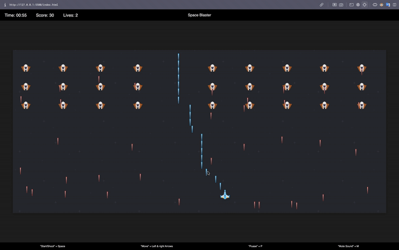
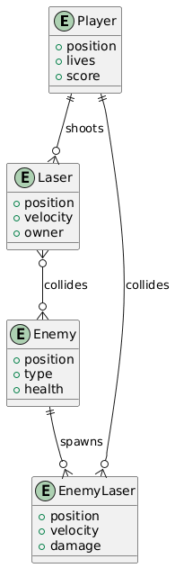
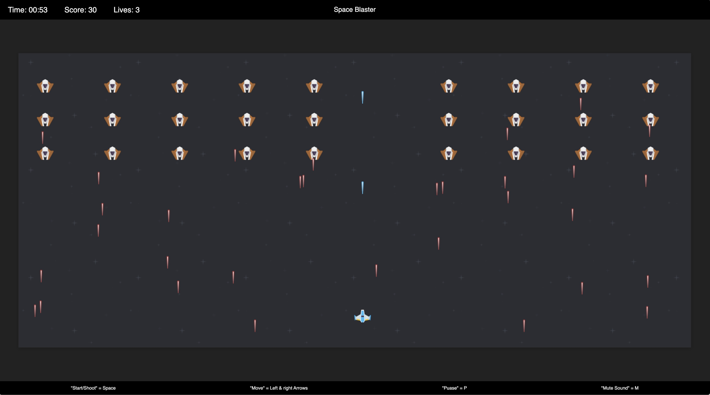
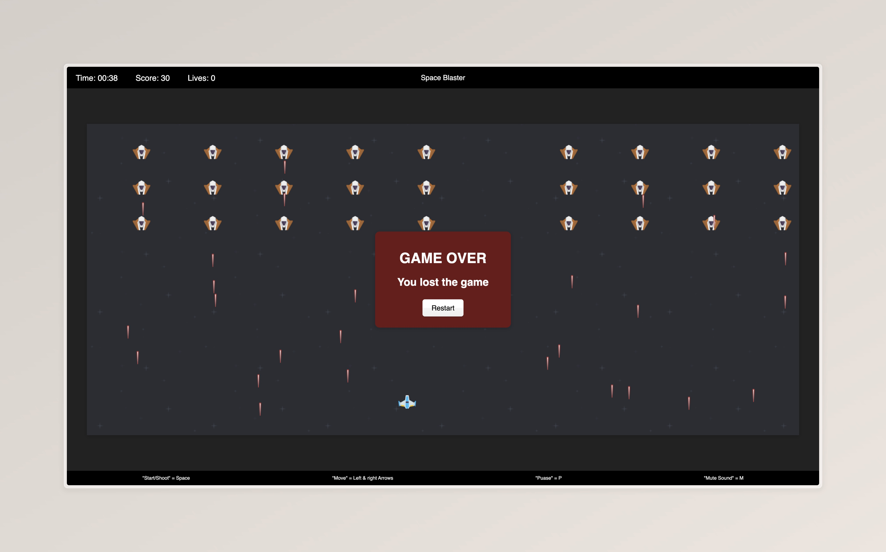
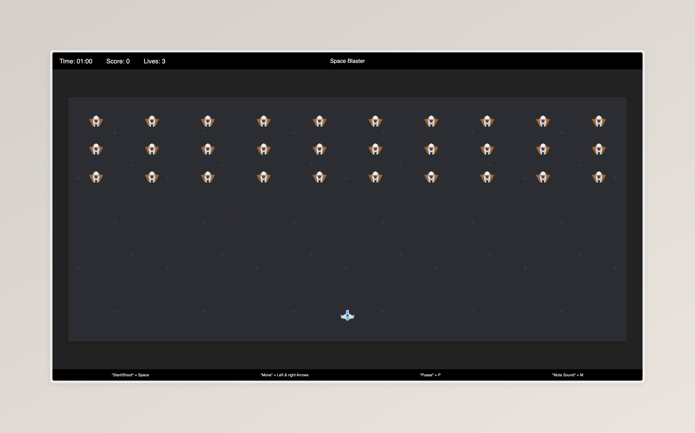

# Space Blaster 🚀

[](https://html.spec.whatwg.org/)
[](https://www.w3.org/Style/CSS/)
[](https://www.ecma-international.org/publications-and-standards/standards/ecma-262/)
[](LICENSE.md)

<!-- 🎮 Animated Gameplay Preview -->
<p align="center">
  
</p>

<p align="center">
  <strong>Classic arcade action.</strong><br/>
  <em>Move fast. Shoot smart. Survive the waves.</em>
</p>

<!-- 🔗 Quick Navigation -->
<p align="center">
  <a href="#-features">Features</a> •
  <a href="#-technologies-used">Tech Stack</a> •
  <a href="#-getting-started">Getting Started</a> •
  <a href="#-how-to-play">How to Play</a> •
  <a href="#-screenshots">Screenshots</a>
</p>

---

---

## Overview

**Space Blaster** is a browser-based space shooter game built with **HTML**, **CSS**, and **JavaScript**. Players control a spaceship to defend against waves of enemies, fire lasers, survive increasingly challenging encounters, and aim for the highest possible score.

The project delivers a classic arcade-style experience while demonstrating clean game logic, DOM-based rendering, and structured JavaScript architecture.

---

## ✨ Features

Space Blaster includes the following core gameplay and system features:

- **Player Movement and Controls** 🎮  
  Control the spaceship using the left and right arrow keys with smooth and responsive movement.

- **Laser Shooting** 🔫  
  Fire lasers using the space bar to eliminate incoming enemies.

- **Enemy Waves** 👾  
  Enemies appear in waves, move strategically, and shoot back, increasing the challenge over time.

- **Scoring System** 🏆  
  Points are awarded for each enemy destroyed. The HUD displays score, time, and remaining lives.

- **Lives and Health** ❤️  
  The player starts with multiple lives. Getting hit by enemy lasers reduces lives until game over.

- **Pause and Resume** ⏸️  
  Pause or resume gameplay instantly using the **P** key.

- **Mute / Unmute Sounds** 🔇  
  Toggle sound effects and background audio using the **M** key.

- **Game Over and Congratulations Screens** 🏅  
  Display end-game results and milestone-based congratulatory messages.

- **Restart Functionality** 🔄  
  Restart the game easily after a game-over screen to attempt a higher score.

---

## 🛠️ Technologies Used

Space Blaster is built entirely with standard web technologies:

- **HTML** 🌐 – Structures the game layout and interface  
- **CSS** 🎨 – Styles the game, HUD, and screens  
- **JavaScript (ES6)** ⚡ – Manages game logic, animations, and events  
- **DOM Manipulation** 🖼️ – Renders and animates game elements  
- **Audio API** 🔊 – Controls sound effects and background music  

These technologies ensure compatibility and smooth performance across modern browsers.

---

## 🎯 Project Objective

The objective of Space Blaster is to recreate the feel of classic arcade shooters while focusing on core gameplay mechanics:

### Core Game Elements

1. **Player** 👤 – User-controlled spaceship  
2. **Enemies** 👾 – AI-controlled opponents  
3. **Lasers** 🔫 – Projectiles from both player and enemies  
4. **HUD** 📊 – Displays score, time, and lives  

Game state and logic are fully managed using JavaScript functions and variables.

---

## 🔁 Game Logic Overview

The game operates using a continuous update loop:

```
Player Input → Update Positions → Check Collisions → Render Frame → Repeat
```

| Component | Purpose                  | Key Functions                  |
|---------|--------------------------|--------------------------------|
| Player  | User-controlled ship     | createPlayer(), updatePlayer() |
| Enemies | AI opponents             | createEnemy(), updateEnemies() |
| Lasers  | Projectiles              | createLaser(), updateLasers()  |
| HUD     | Game information display | updateHUD()                    |

---

## 👣 Player Flow

```
Start Game → Move & Shoot → Survive Waves → Game Over → Restart
```

- Players begin the game, control the ship, defeat enemies, and attempt to survive as long as possible.
- Scores increase progressively with each enemy destroyed.

---

## 🚀 Getting Started

### Prerequisites

- A modern web browser (Chrome, Firefox, Safari, Edge)
- No additional installations required

### Installation

1. Clone the repository:
   ```bash
   git clone https://github.com/sahmedhusain/spaceblaster.git
   ```
2. Navigate to the project directory:
   ```bash
   cd spaceblaster
   ```
3. Open the game:
   ```bash
   open index.html
   ```
   Alternatively, double-click the file.

---

## 📖 How to Play

1. Click **Start** to begin the game  
2. Move using **Left / Right Arrow Keys**  
3. Shoot using the **Space Bar**  
4. Pause / Resume using **P**  
5. Mute / Unmute audio using **M**  
6. Restart after game over  

---

## ⚙️ Game Mechanics

- **Movement**: Horizontal movement within screen boundaries  
- **Shooting**: Unlimited lasers with cooldown control  
- **Enemies**: Spawn from the top and move downward  
- **Collisions**: Lasers and entities are destroyed on contact  

---

## 🧠 Application Logic

### Game Loop

- Uses `requestAnimationFrame` for smooth 60 FPS updates
- Continuously updates player, enemies, lasers, and HUD

### Event Handling

- Listens for key presses and releases
- Prevents invalid or unintended inputs

### State Management

- Tracks active, paused, and game-over states
- Maintains score, time, and lives

---

## 🔍 Detailed Logic Breakdown

### Game Initialization

The `init()` function:
- Creates the player object
- Initializes enemy and laser arrays
- Sets initial score, lives, and time
- Loads and prepares audio assets

### Main Update Cycle

Executed every frame:
1. Calculate delta time  
2. Update player position  
3. Update lasers  
4. Update enemies  
5. Detect collisions  
6. Update HUD  
7. Check end-game conditions  

### Enemy Behavior

- Grid-based movement
- Random laser firing
- New wave spawns after elimination

### Laser Mechanics

- Player lasers travel upward
- Enemy lasers travel downward
- Rectangle overlap collision detection

### Scoring & Lives

- Enemy destroyed: +10 points  
- Player hit: −1 life  
- Time bonus applied at game end  

### Pause & Audio Control

- Pause halts the game loop
- Mute sets all audio volume to zero

---

## 📊 ERD (Entity Relationship Diagram)

Although no database is used, this diagram represents in-game entity relationships:



---

## 📈 Game Flowchart


---

## 💻 Terminal Examples

### Open the Game

```bash
cd spaceblaster
open index.html
```

### Project Structure

```bash
ls -la
```

### Optional Local Server

```bash
python3 -m http.server 8000
```

---

## 📸 Screenshots






---

## 🛠️ Code Structure

- **index.html** – Game layout
- **css/main.css** – UI styling
- **js/game.js** – Main game loop
- **js/player.js** – Player logic
- **js/enemy.js** – Enemy behavior
- **js/laser.js** – Laser mechanics
- **js/control.js** – Input handling

---

## ⚠️ Error Handling

- Invalid inputs are ignored
- DOM rendering issues are logged
- Audio loading failures default to silent mode

---

## 🤝 Contributing

Fork the repository, apply improvements, and submit a pull request. Please follow JavaScript best practices and test across multiple browsers.

---

## 📄 License

Licensed under the MIT License. See [LICENSE.md](LICENSE.md) for details.

---

## 🙏 Acknowledgments

Created as part of a web game development learning experience, inspired by classic space shooter games.

---

## 👥 Authors

- **Sayed Ahmed Husain** – [sayedahmed97.sad@gmail.com](mailto:sayedahmed97.sad@gmail.com)  
- **Qassim Aljaffer**

---

## 📚 What I Learned

- HTML5 and DOM-based game development  
- JavaScript game loops and event handling  
- Object-oriented programming concepts  
- Audio and graphics integration  
- Cross-browser compatibility  

---

## 🚫 Limitations

- No progressive difficulty levels  
- Limited enemy variety  
- Basic visuals and sound effects  
- No high-score persistence  

---

## 🔮 Future Improvements

- Multiple levels with increasing difficulty  
- Power-ups and special weapons  
- Enhanced graphics and animations  
- Online leaderboards  
- Multiplayer support
